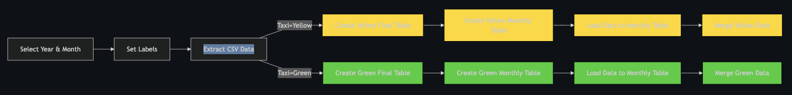
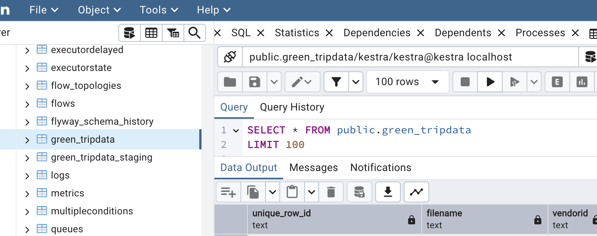
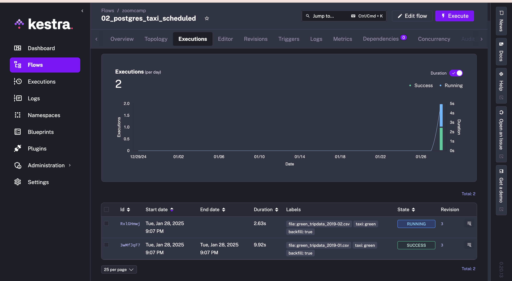
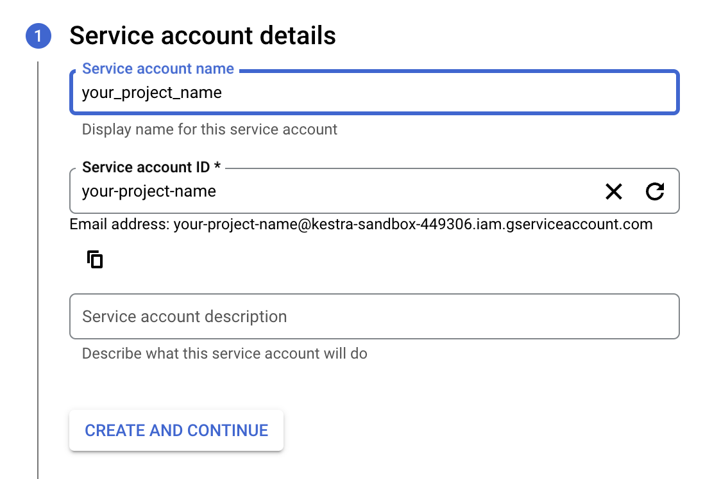
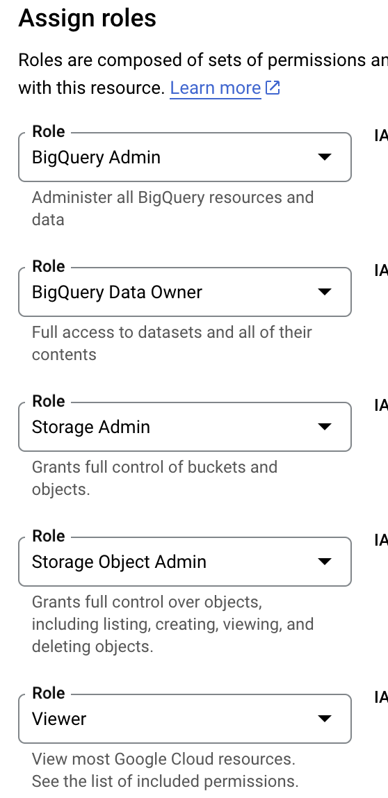
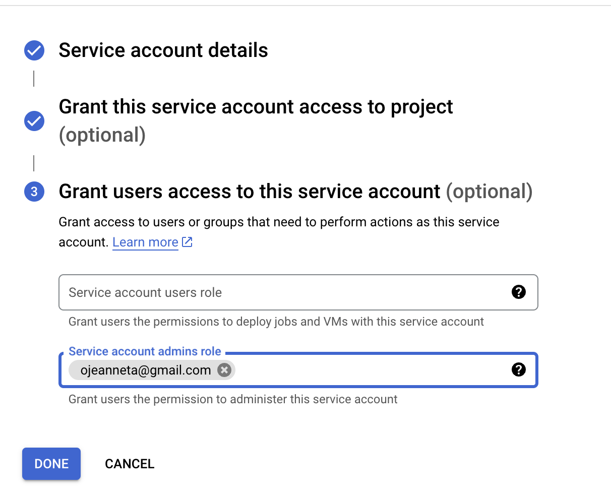
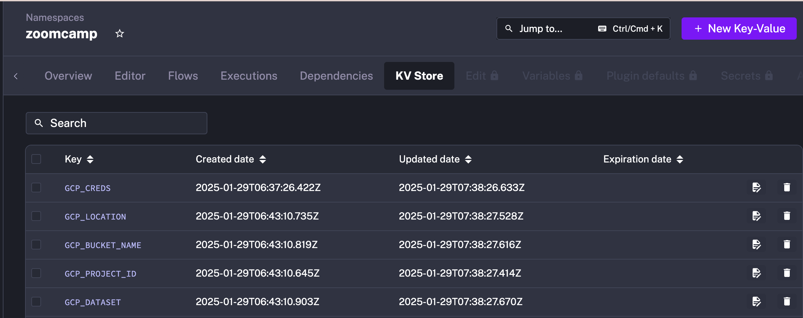
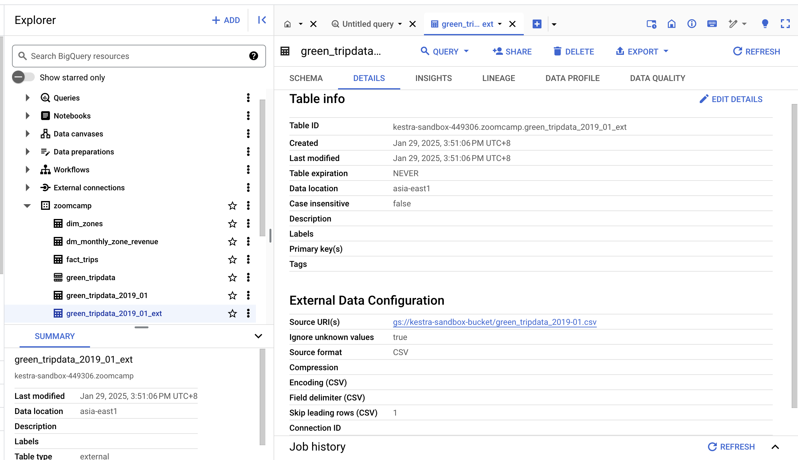
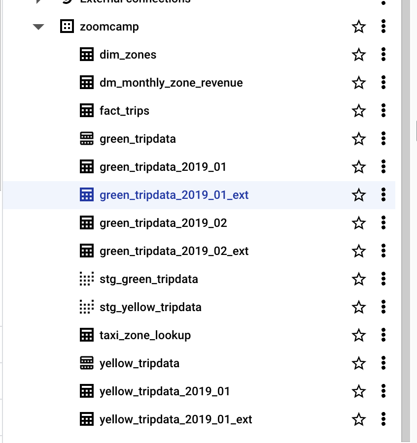

# WEEK2 - Workflow Orchestration

Links:

https://www.youtube.com/playlist?list=PLEK3H8YwZn1oPPShk2p5k3E9vO-gPnUCf

[DataTalksClub](https://github.com/DataTalksClub/data-engineering-zoomcamp/tree/main/02-workflow-orchestration)

# **Hands-On Coding Project: Build Data Pipelines with Kestra**

Project Flow:

This week, we're gonna build ETL pipelines for Yellow and Green Taxi data from NYC’s Taxi and Limousine Commission (TLC). You will:

1. Extract data from [CSV files](https://github.com/DataTalksClub/nyc-tlc-data/releases).
2. Load it into Postgres or Google Cloud (GCS + BigQuery).
3. Explore scheduling and backfilling workflows.

Set Up Kestra Using Docker Compose 

> `docker-compose.yml`
> 

Start the services by running `docker compose up -d`

```python
volumes:
  postgres-data:
    driver: local
  kestra-data:
    driver: local

services:
  postgres:
    image: postgres
    volumes:
      - postgres-data:/var/lib/postgresql/data
    environment:
      POSTGRES_DB: kestra
      POSTGRES_USER: kestra
      POSTGRES_PASSWORD: k3str4
    healthcheck:
      test: ["CMD-SHELL", "pg_isready -d $${POSTGRES_DB} -U $${POSTGRES_USER}"]
      interval: 30s
      timeout: 10s
      retries: 10
    ports:
      - "5433:5432"

  kestra:
    image: kestra/kestra:latest
    pull_policy: always
    user: "root"
    command: server standalone
    volumes:
      - kestra-data:/app/storage
      - /var/run/docker.sock:/var/run/docker.sock
      - /tmp/kestra-wd:/tmp/kestra-wd
    environment:
      KESTRA_CONFIGURATION: |
        datasources:
          postgres:
            url: jdbc:postgresql://postgres:5432/kestra
            driverClassName: org.postgresql.Driver
            username: kestra
            password: k3str4
        kestra:
          server:
            basicAuth:
              enabled: false
              username: "admin@kestra.io" # it must be a valid email address
              password: kestra
          repository:
            type: postgres
          storage:
            type: local
            local:
              basePath: "/app/storage"
          queue:
            type: postgres
          tasks:
            tmpDir:
              path: /tmp/kestra-wd/tmp
          url: http://localhost:8080/
    ports:
      - "8080:8080"
      - "8081:8081"
    depends_on:
      postgres:
        condition: service_started
```

### **Docker Compose Configuration Overview**

### **Volumes**

- `postgres-data` and `kestra-data`: Store persistent data for the database and Kestra application.

### **Services**

1. **Postgres**
    - **Image:** Official `postgres`
    - **Volumes:** Stores data at `/var/lib/postgresql/data`
    - **Environment Variables:** Sets up database name, user, and password
    - **Healthcheck:** Verifies PostgreSQL readiness using `pg_isready`
    - Ports: 5433:5432
2. **Kestra**
    - **Image:** `kestra/kestra:latest`
    - **Command:** Runs in standalone server mode
    - **Volumes:**
        - `/app/storage`: Maintains Kestra data
        - `/var/run/docker.sock`: Enables Docker daemon communication
        - `/tmp/kestra-wd`: Serves as working directory
    - **Environment Variables:** Establishes PostgreSQL connection and Kestra configuration
    - **Ports:** Makes ports `8080` and `8081` available
    - **Depends_on:** Ensures Postgres is running before starting

---

## **Load Taxi Data to Postgres**

The flow will extract CSV data partitioned by year and month, create tables, load data to the monthly table, and finally merge the data to the final destination table.



To push the flow on the kestra interface  : 

```python
curl -X POST http://localhost:8080/api/v1/flows/import -F fileUpload=@flows/02_postgres_taxi.yaml
```

for running the [02_postgres_taxi.yaml](https://github.com/jeanneta/data-engineering-zoomcamp-2025/blob/main/week02/flows/02_postgres_taxi.yaml)

I added pgAdmin for database visualization in Docker Compose.

```python
  pgadmin:
    image: dpage/pgadmin4
    environment:
      - PGADMIN_DEFAULT_EMAIL=admin@admin.com
      - PGADMIN_DEFAULT_PASSWORD=root
    volumes:
      - "./data_pgadmin:/var/lib/pgadmin"
    ports:
      - "8090:80"
    depends_on:
      - postgres 
```

and in 02_postgres_taxi.yaml, i change pluginDefaults from this:

```python
pluginDefaults:
  - type: io.kestra.plugin.jdbc.postgresql
    values:
      url: jdbc:postgresql://host.docker.internal:5432/postgres-zoomcamp
      username: kestra
      password: k3str4
```

to this:

```python
pluginDefaults:
  - type: io.kestra.plugin.jdbc.postgresql
    values:
      url: jdbc:postgresql://host.docker.internal:5433/kestra
      username: kestra
      password: k3str4
```

Once the container starts, you can access the Kestra UI at [http://localhost:8080](http://localhost:8080/) and the pgadmin web in [http://localhost:8090](http://localhost:8090/)

To connect pgadmin with the kestra db: register your server with give the Server a name: kestra localhost

Under Connection add:

- host name: postgres
- port:5432
- user:kestra
- password:k3str4

After your running your flow on 02_postgres_taxi, you can view your ingested data ‘green_tripdata’ and ‘green_tripdata_staging’ has been ingested.



---

## **Kestra Workflow Notes: NYC Taxi Data Pipeline**

### **Workflow Overview**

- **Workflow ID:** `02_postgres_taxi`
- **Namespace:** `zoomcamp`
- **Description:** Downloads and processes NYC Taxi trip data (yellow and green taxis) from [DataTalksClub](https://github.com/DataTalksClub/nyc-tlc-data/releases) ([https://github.com/DataTalksClub/nyc-tlc-data/releases](https://github.com/DataTalksClub/nyc-tlc-data/releases))

### **Workflow Inputs**

```python
inputs:
  - id: taxi
    type: SELECT
    displayName: Select taxi type
    values: [yellow, green]
    defaults: yellow

  - id: year
    type: SELECT
    displayName: Select year
    values: ["2019", "2020"]
    defaults: "2019"

  - id: month
    type: SELECT
    displayName: Select month
    values: ["01", "02", "03", "04", "05", "06", "07", "08", "09", "10", "11", "12"]
    defaults: "01"
```

- **Taxi Type:** Select between `yellow` and `green` taxis (default: `yellow`)
- **Year:** Choose between `2019` and `2020` (default: `2019`)
- **Month:** Select month from `01` to `12` (default: `01`)

---

### **Pipeline Variables**

```python
variables:
  file: "{{inputs.taxi}}_tripdata_{{inputs.year}}-{{inputs.month}}.csv"
  staging_table: "public.{{inputs.taxi}}_tripdata_staging"
  table: "public.{{inputs.taxi}}_tripdata"
  data: "{{outputs.extract.outputFiles[inputs.taxi ~ '_tripdata_' ~ inputs.year ~ '-' ~ inputs.month ~ '.csv']}}"
```

- **`file`:** Filename for the CSV fileExample: `yellow_tripdata_2019-01.csv`
- **`staging_table`:** Staging table name in PostgreSQLExample: `public.yellow_tripdata_staging`
- **`table`:** Destination table name in PostgreSQLExample: `public.yellow_tripdata`
- **`data`:** Path to the extracted CSV data file

---

### **Pipeline Tasks**

### **1. Set Workflow Labels (`set_label`)**

- Adds dynamic labels for file and taxi type.

### **2. Data Extraction (`extract`)**

- Command: Downloads and extracts the CSV file directly from the provided GitHub URL.
- File is decompressed using `gunzip`.

```python
- id: extract
  type: io.kestra.plugin.scripts.shell.Commands
  outputFiles:
    - "*.csv"
  taskRunner:
    type: io.kestra.plugin.core.runner.Process
  commands:
    - wget -qO- https://github.com/DataTalksClub/nyc-tlc-data/releases/download/{{inputs.taxi}}/{{render(vars.file)}}.gz | gunzip > {{render(vars.file)}}
```

---

### **Yellow Taxi Workflow Tasks**

```python
- id: if_yellow_taxi
  type: io.kestra.plugin.core.flow.If
  condition: "{{inputs.taxi == 'yellow'}}"
  then:
    - id: yellow_create_table
      type: io.kestra.plugin.jdbc.postgresql.Queries
      sql: |
        CREATE TABLE IF NOT EXISTS {{render(vars.table)}} (
            unique_row_id          text,
            filename               text,
            VendorID               text,
            tpep_pickup_datetime   timestamp,
            ...
            congestion_surcharge   double precision
        );
```

- This conditional block checks if the selected taxi type is `yellow`.
- If true, it creates the `yellow_tripdata` table with appropriate schema columns such as `VendorID`, `pickup_datetime`, and `congestion_surcharge`.

---

### **Staging Table and Data Ingestion**

```python
- id: yellow_create_staging_table
  type: io.kestra.plugin.jdbc.postgresql.Queries
  sql: |
    CREATE TABLE IF NOT EXISTS {{render(vars.staging_table)}} (
        unique_row_id          text,
        filename               text,
        VendorID               text,
        ...
    );
    
- id: yellow_copy_in_to_staging_table
  type: io.kestra.plugin.jdbc.postgresql.CopyIn
  format: CSV
  from: "{{render(vars.data)}}"
  table: "{{render(vars.staging_table)}}"
  header: true
  columns: [VendorID,tpep_pickup_datetime,tpep_dropoff_datetime,passenger_count,trip_distance,...]

```

### Explanation:

- Creates a **staging table** to temporarily hold the CSV data before transformation.
- The `CopyIn` task efficiently **ingests the CSV data** directly into the staging table.

---

### **Key Notes**

- **Data Integrity:**
    - The use of `unique_row_id` ensures consistent and non-duplicated data entries for both yellow and green taxi datasets.
- **Dynamic Query Handling:**
    - Variables are dynamically rendered for table names and file paths, enabling flexible task execution.
- **PostgreSQL Table Structure:**
    - Differences between `yellow` and `green` taxi tables are handled through separate task branches.

## **Scheduling and Backfills**

code: [02_postgres_taxi_scheduled.yaml](https://github.com/jeanneta/data-engineering-zoomcamp-2025/blob/main/week02/flows/02_postgres_taxi_scheduled.yaml)

To push the flow on the kestra interface  : 

```bash
curl -X POST http://localhost:8080/api/v1/flows/import -F fileUpload=@flows/02_postgres_taxi_scheduled.yaml
```

### How to Run:

flows > 02_postgres_taxi_scheduled.yaml > triggers > choose `Backfill executions`  

Select taxi type, start date and end date > execute backfill

After that, you can view your jobs running in executions tab



## **Orchestrate dbt Models**

code: [03_postgres_dbt.yaml](https://github.com/jeanneta/data-engineering-zoomcamp-2025/blob/main/week02/flows/03_postgres_dbt.yaml)

> Before starting your dbt task, ensure you have ingested both yellow and green taxi data into your local Postgres database. Then you can use dbt to transform the data into meaningful insights. The flow will sync the dbt models from Git to Kestra and run the `dbt build` command to build the models.
> 


Push the flow on the kestra interface  : 

```python
curl -X POST http://localhost:8080/api/v1/flows/import -F fileUpload=@flows/03_postgres_dbt.yaml
```

### A Quick Look at dbt Before Our Upcoming Course

dbt (Data Build Tool) is a transformation tool that lets data analysts and engineers transform warehouse data more effectively. Using SQL, you can write, document, and execute data transformations while following software engineering best practices—including modularity, portability, CI/CD, and documentation. Later sections of this Data Engineering course will explore how to integrate dbt into our data pipelines for better maintainable transformations.

We'll examine how to combine dbt with Kestra to build a simple yet powerful transformation pipeline. This integration lets us manage data transformations as code while using Kestra's orchestration features. We'll focus on three key areas: model definitions, project structure, and executing dbt commands in our Kestra workflow.

After running your dbt models, your local postgresql will be added a new columns: dim_zones, dm_monthly_zone_revenue, fact_trips

# ETL Pipelines in Kestra : Google Cloud Platform

Now that we’ve learned how to build an ETL pipelines locally with Postgres, we can move to the cloud. In this section, we’ll load the same Yellow and Green Taxi data to GCP using **GCS and BigQuery.** 

More precisely, we'll extract data from our CSV files as before, but instead of loading them into Postgres, we'll upload them to Google Cloud Storage. From there, BigQuery can automatically create tables from these files, allowing us to process data and run queries. This follows the same workflow as before, with the added advantage that we can now handle the Yellow Taxi files—which were too large to process efficiently in Postgres.

Let’s add all the flows on Kestra UI susing its API. Here is the code : 

```python
curl -X POST http://localhost:8080/api/v1/flows/import -F fileUpload=@flows/04_gcp_kv.yaml
curl -X POST http://localhost:8080/api/v1/flows/import -F fileUpload=@flows/05_gcp_setup.yaml
curl -X POST http://localhost:8080/api/v1/flows/import -F fileUpload=@flows/06_gcp_taxi.yaml
curl -X POST http://localhost:8080/api/v1/flows/import -F fileUpload=@flows/06_gcp_taxi_scheduled.yaml
curl -X POST http://localhost:8080/api/v1/flows/import -F fileUpload=@flows/07_gcp_dbt.yaml
```

## Setup GCP

Before starting with GCP, we need to setup it. To do so, we use the flow : 🔗 [04_gcp_kv.yaml.](https://github.com/jeanneta/data-engineering-zoomcamp-2025/blob/main/week02/flows/04_gcp_kv.yaml)

```python
id: 04_gcp_kv
namespace: zoomcamp

tasks:
  - id: gcp_creds
    type: io.kestra.plugin.core.kv.Set
    key: GCP_CREDS
    kvType: JSON
    value: |
      {
        "type": "service_account",
        "project_id": "...",
      }

  - id: gcp_project_id
    type: io.kestra.plugin.core.kv.Set
    key: GCP_PROJECT_ID
    kvType: STRING
    value: kestra-sandbox # TODO replace with your project id

  - id: gcp_location
    type: io.kestra.plugin.core.kv.Set
    key: GCP_LOCATION
    kvType: STRING
    value: europe-west2

  - id: gcp_bucket_name
    type: io.kestra.plugin.core.kv.Set
    key: GCP_BUCKET_NAME
    kvType: STRING
    value: your-name-kestra # TODO make sure it's globally unique!

  - id: gcp_dataset
    type: io.kestra.plugin.core.kv.Set
    key: GCP_DATASET
    kvType: STRING
    value: zoomcamp
```

Replace the different values with the right ones and for `GCP_CREDS`, create a key for a service account and copy there the json key.

Steps:

1. Create new project
2. [IAM & Admin](https://console.cloud.google.com/iam-admin?inv=1&invt=AboIHg&orgonly=true&project=kestra-sandbox-449306&supportedpurview=organizationId,folder,project) [](https://www.notion.so/WEEK2-Workflow-Orchestration-189cbebde5a180f7a9b8f9b1f29a4f84?pvs=21)> Service accounts > Create service account



Assign this roles:





After you successfully create your success account, click the account you just created, create a new keys for your gcp creds > export json > after you download your creds_keys.json, open it and copy all your creds and put inside the value

```python
  - id: gcp_creds
    type: io.kestra.plugin.core.kv.Set
    key: GCP_CREDS
    kvType: JSON
    value: |
      {
        "type": "service_account",
        "project_id": "...",
      }
```

make sure you correctly input your GCP_PROJECT_ID, GCP_LOCATION, GCP_BUCKET_NAME, GCP_DATASET values. 

Then you can execute your **04_gcp_kv. After it is succcess, you can go to Namespaces > Zoomcamp(this is my namespace) > kv store, now you can see your keys is already uploted to kv store**



Now you can execute [05_gcp_setup](https://github.com/jeanneta/data-engineering-zoomcamp-2025/blob/main/week02/flows/05_gcp_setup.yaml) to verify your credentials and create a new dataset in BigQuery. If this succeeds, you can proceed to run the [06_gcp_taxi](https://github.com/jeanneta/data-engineering-zoomcamp-2025/blob/main/week02/flows/06_gcp_taxi.yaml) and [06_gcp_taxi_scheduled](https://github.com/jeanneta/data-engineering-zoomcamp-2025/blob/main/week02/flows/06_gcp_taxi_scheduled.yaml) tasks.

After successfully running the 06_gcp_taxi_scheduled task, you can find your exported data in your GCP buckets. In BigQuery, you can view the table schemas and details



Before running [07_gcp_dbt](https://github.com/jeanneta/data-engineering-zoomcamp-2025/blob/main/week02/flows/07_gcp_dbt.yaml), ensure you've completed the task to ingest both yellow and green datasets into BigQuery. Once you execute 07_gcp_dbt successfully, your BigQuery will look like this 


