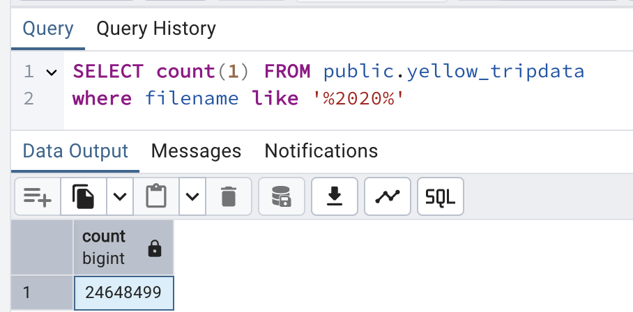
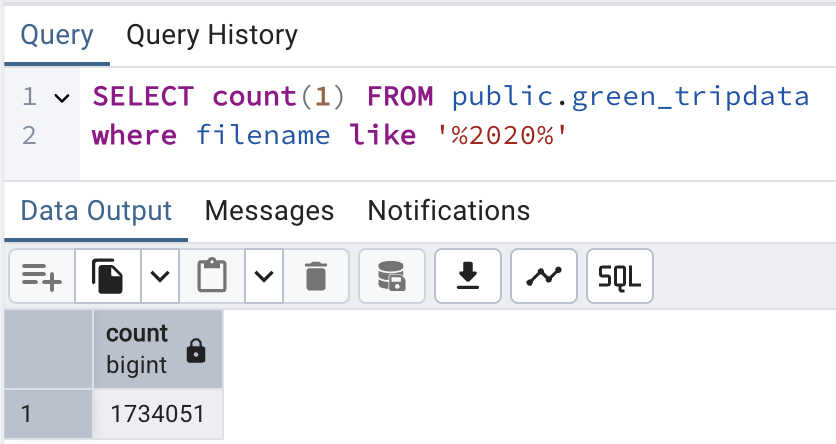
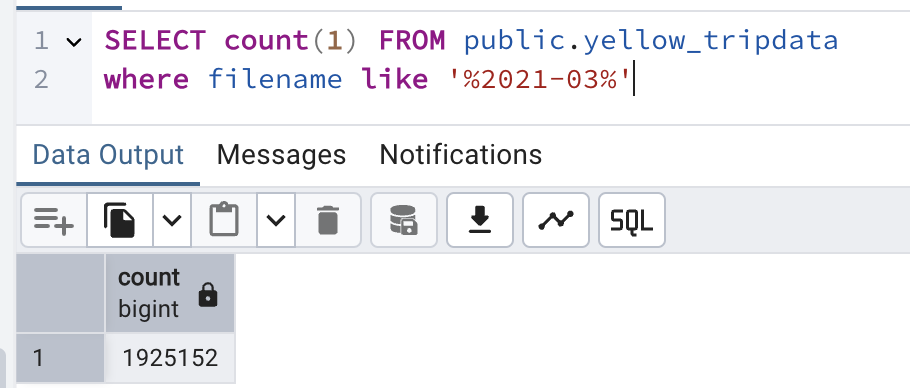

# Homework - WEEK 2

**Quiz Questions**

1. Within the execution for `Yellow` Taxi data for the year `2020` and month `12`: what is the uncompressed file size (i.e. the output file `yellow_tripdata_2020-12.csv` of the `extract` task)?

Answer: 
• 128.3 MB

From `02_postgres_taxi.yaml`, I uncommented the purge_files task, allowing the output extract file to remain stored inside Kestra outputs.

```yaml
  - id: purge_files
    type: io.kestra.plugin.core.storage.PurgeCurrentExecutionFiles
    description: This will remove output files. If you'd like to explore Kestra outputs, disable it.
```

1. What is the rendered value of the variable `file` when the inputs `taxi` is set to `green`, `year` is set to `2020`, and `month` is set to `04` during execution?

```python
variables:
  file: "{{inputs.taxi}}_tripdata_{{inputs.year}}-{{inputs.month}}.csv"
```

The rendered value of the variable `file` will be green_tripdata_2020-04.csv

Answer: green_tripdata_2020-04.csv

1. How many rows are there for the `Yellow` Taxi data for all CSV files in the year 2020?

Answer: 24,648,499

```python
SELECT count(1) FROM public.yellow_tripdata
where filename like '%2020%'
```



1. How many rows are there for the `Green` Taxi data for all CSV files in the year 2020?

Answer:  1,734,051

```python
SELECT count(1) FROM public.green_tripdata
where filename like '%2020%'
```




1. How many rows are there for the `Yellow` Taxi data for the **March** **2021** CSV file?

Answer: 1,925,152

```python
SELECT count(1) FROM public.yellow_tripdata
where filename like '%2021-03%'
```




1. How would you configure the timezone to New York in a Schedule trigger?

Answer:  Add a `timezone` property set to `America/New_York` in the `Schedule` trigger configuration

For New York, `timezone: America/New_York`