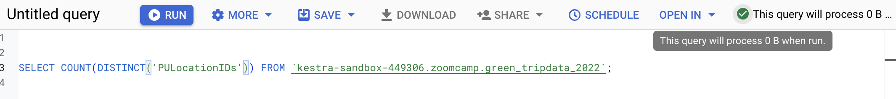
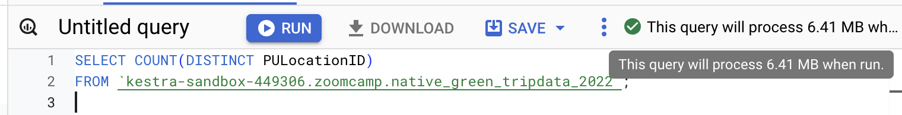
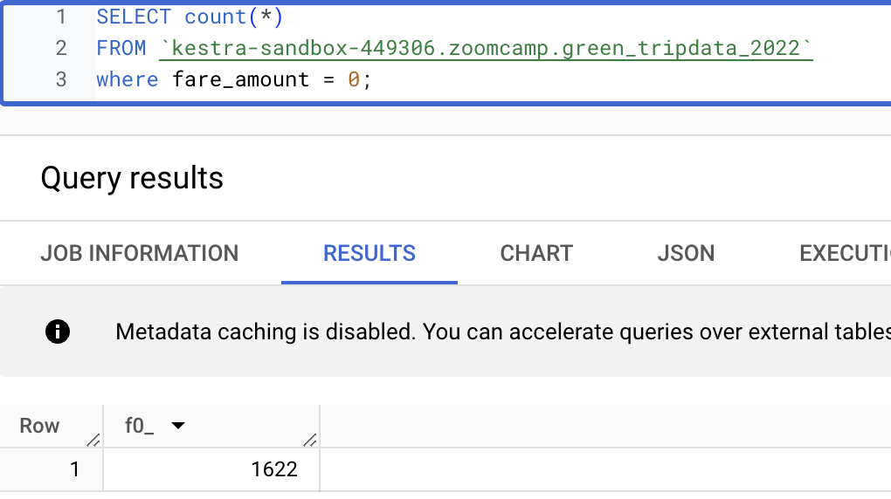
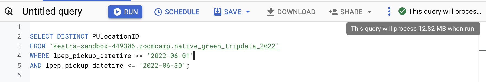
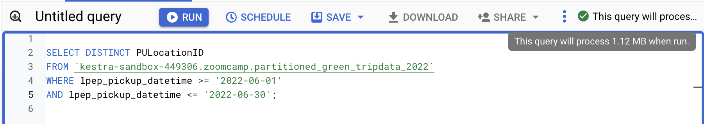
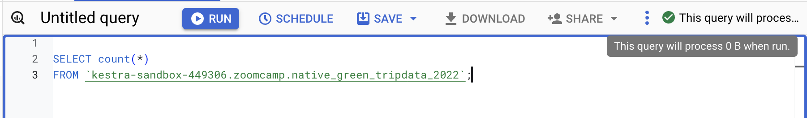
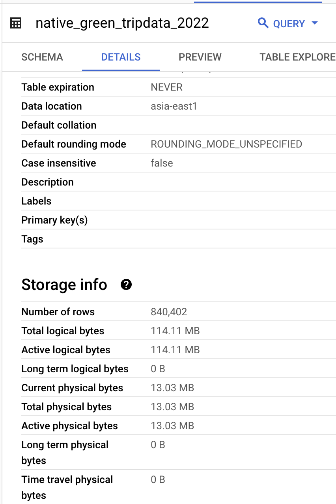

# HOMEWORK - WEEK 3

For this homework we will be using the 2022 Green Taxi Trip Record Parquet Files from the New York City Taxi Data found here:

[https://www.nyc.gov/site/tlc/about/tlc-trip-record-data.page](https://www.nyc.gov/site/tlc/about/tlc-trip-record-data.page)

If you are using orchestration such as Mage, Airflow or Prefect do not load the data into Big Query using the orchestrator.

Stop with loading the files into a bucket.

NOTE: You will need to use the PARQUET option files when creating an External Table

**SETUP:**

- Create an external table using the Green Taxi Trip Records Data for 2022.
- Create a table in BQ using the Green Taxi Trip Records for 2022 (do not partition or cluster this table).

**Inserting data manually:**

First download all the dataset from [https://www.nyc.gov/site/tlc/about/tlc-trip-record-data.page](https://www.nyc.gov/site/tlc/about/tlc-trip-record-data.page). Upload dataset to google storage: open your current bucket and click upload.

Creating external table i**n BigQuery**

```python
CREATE OR REPLACE EXTERNAL TABLE `kestra-sandbox-449306.zoomcamp.green_tripdata_2022`
OPTIONS (
  format = 'PARQUET',
  uris = ['gs://kestra-sandbox-bucket/green_tripdata_2022-*.parquet']
);
```

Creating native table

```python
CREATE OR REPLACE TABLE kestra-sandbox-449306.zoomcamp.native_green_tripdata_2022
AS (
  SELECT * FROM `kestra-sandbox-449306.zoomcamp.green_tripdata_2022`
);
```

Note: **external tables** allow querying data directly from its source location, while **native tables** store data within BigQuery itself—offering better performance but requiring storage costs.

## Question 1:

What is count of records for the 2022 Green Taxi Data??

Answer: 840402

```python
SELECT count(1) FROM `kestra-sandbox-449306.zoomcamp.green_tripdata_2022`;
```

## **Question 2:**

Write a query to count the distinct number of PULocationIDs for the entire dataset on both the tables.

What is the estimated amount of data that will be read when this query is executed on the External Table and the Table?

External Table:

```python
SELECT COUNT(DISTINCT('PULocationIDs')) FROM `kestra-sandbox-449306.zoomcamp.green_tripdata_2022`;
```



Native Table:

```python
SELECT COUNT(DISTINCT PULocationID) 
FROM `kestra-sandbox-449306.zoomcamp.native_green_tripdata_2022`;
```



Answer:  0 MB for the External Table and 6.41MB for the Materialized Table

## **Question 3:**

How many records have a fare_amount of 0?

Answer: 1622

```python
SELECT count(*)
FROM `kestra-sandbox-449306.zoomcamp.green_tripdata_2022`
where fare_amount = 0;
```



## **Question 4:**

What is the best strategy to make an optimized table in Big Query if your query will always order the results by PUlocationID and filter based on lpep_pickup_datetime? (Create a new table with this strategy)

Answer: Partition by lpep_pickup_datetime Cluster on PUlocationID

```python
CREATE OR REPLACE TABLE kestra-sandbox-449306.zoomcamp.partitioned_green_tripdata_2022
PARTITION BY DATE(lpep_pickup_datetime)
CLUSTER BY PUlocationID
AS(
  SELECT * FROM kestra-sandbox-449306.zoomcamp.native_green_tripdata_2022
);
```

## **Question 5:**

Write a query to retrieve the distinct PULocationID between lpep_pickup_datetime 06/01/2022 and 06/30/2022 (inclusive)

Use the materialized table you created earlier in your from clause and note the estimated bytes. Now change the table in the from clause to the partitioned table you created for question 4 and note the estimated bytes processed. What are these values?

Choose the answer which most closely matches.

Answer: 12.82 MB for non-partitioned table and 1.12 MB for the partitioned table

Native table:

```python
SELECT DISTINCT PULocationID
FROM `kestra-sandbox-449306.zoomcamp.native_green_tripdata_2022`
WHERE lpep_pickup_datetime >= '2022-06-01'
AND lpep_pickup_datetime <= '2022-06-30';
```



Partition table:

```python
SELECT DISTINCT PULocationID
FROM `kestra-sandbox-449306.zoomcamp.partitioned_green_tripdata_2022`
WHERE lpep_pickup_datetime >= '2022-06-01'
AND lpep_pickup_datetime <= '2022-06-30';
```



## **Question 6:**

Where is the data stored in the External Table you created?

Answer: GCP Bucket

The external table in BigQuery doesn't store data within BigQuery itself. Instead, it points to data stored in an external source. In your case, the data for the external table is stored in **Google Cloud Storage (GCS)**.

## **Question 7:**

It is best practice in Big Query to always cluster your data:

Answer: False

Clustering helps speed up queries by organizing related data together. It's helpful if your queries often filter or sort by specific columns, like dates or locations. But for small tables or random query patterns, clustering may not make a big difference and isn't always worth it.

## **(Bonus: Not worth points) Question 8:**

No Points: Write a `SELECT count(*)` query FROM the materialized table you created. How many bytes does it estimate will be read? Why?

Answer: 0 bytes

BigQuery won't read any bytes for a simple count query since it stores the total row count in its metadata, allowing it to return the count without scanning the actual data.

```python
SELECT count(*)
FROM `kestra-sandbox-449306.zoomcamp.native_green_tripdata_2022`;
```



